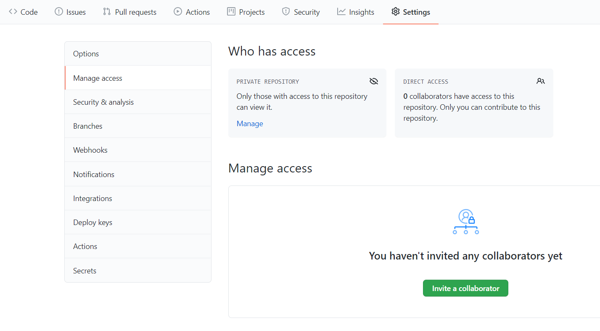

# TASK 1: Teamwork in the Cloud

The first two weeks of labs will be warm-up exercises giving you time to set up your working methods, test and try all the basic Java concepts given in lectures and as lab tasks, and also establish how to work in your team effectively and efficiently. The purpose of this first TASK 1 is to try out the Java toolchain, in particular use the `javac`, `java` and `git` commands to work together in your pair programming team in the Cloud. Nothing needs to be submitted, and there are no marks, but it is essential to do this formative exercise to get off to a good start.

## Pair Programming Team

We expect you to do all the exercises and projects for the unit in pairs. Everybody should by now be in a team of two registered on the unit website. You should use the labs to work through the tasks together, and support the labs with some extra work in your team outside labs if required. This is how you will learn most throughout the unit. From week 15 onwards you should spend about 7h per week on this unit including labs and lectures. This exercise should take you no longer than 2h.

## Code Sharing

At the end of this lab you should be able to work in your pair programming team together on a private online repository where you can share code within your team. You are at no point allowed to share any code you develop between teams, your project submission later in the year in particular may be checked for plagiarism using automatic, online and manual checks. Both publishing or allowing access to your code to someone outside your team or using code from someone else without clear source indications may amount to plagiarism offences. In any case, all third party code must be cited/referenced as such, with the extent and original source provided in the code base.

* * *

## Compiling and Running Java Programs

Make sure Java is installed on your system or lab machine: read the [setup guide](https://github.com/tom91136/coms10009-wiki/blob/master/SETUP.md) carefully or follow the videos for [Windows](https://mediasite.bris.ac.uk/Mediasite/Play/da355bec145b4c7fa2940738340a454a1d) or [Ubuntu](https://mediasite.bris.ac.uk/Mediasite/Play/eb4047f525c642de8b4bef98c006c2c21d) on Blackboard. To check that you have the javac and java commands installed properly, type:

    $ javac -version
    $ java -version

You should get a message mentioning the version number (same thing) in each case. Next create a local project directory wherein you would like to develop your first tiny project (on a lab machine for instance within C:/users/YourUserName). In this directory create for instance the two source files needed for `RobotWorld`, that is `Robot.java` and `RobotWorld.java` as discussed in the first lecture. Note that there is a convention that Java source files start with a capital letter. On Windows (and some Macs), you need to be careful because the filestore is (partly) case-insensitive. Now try compiling your Java program within your project directory:

    $ javac RobotWorld.java

You will find that this has created two files called `Robot.class` and `RobotWorld.class`. The compiler realised there was a dependency and that both Java class files are required in `RobotWorld` and thus compiled both. Now run the program:

    $ java RobotWorld
    C3PO says 'Hello, Java!'

* * *

**TODO:** Make sure you can compile and run Java programs. Create a few more project folders for the other example programs from the lectures so far, then compile and run them. Understand what is going on in these programs - how and why they work.

* * *

## Managing Code and using a Cloud Repository

In order to work together as a team both of you need to be able to work on the same code and access it from anywhere, your project also needs to be backed up and version control should be available. To achieve all this, first install Git on your system (which is already installed in the lab), and check all is setup properly asking for the Git version ready to run:

    $ git --version

Git should report back the version you have installed. Next, we need a place in the Cloud to be used as a repository. Only one repository is needed for your entire team, that is why only one of you needs to set up a private repository. The other team member will then be given access to it. If you already have access to a private Github account you may want to use your existing one. (It is important that your repository you use is private, so your code is only shared with your team partner and nobody else can copy your work.) If this is your first time in the Cloud, an easy way to get started is to create a free Github account by going to [github.com](https://github.com/) and signing up with your university email address. This should give you access to an account with free private repositories. In Github create a new private repository and name it something like `OOP-01`. Now, on your local machine, navigate into the directory where your .java and .class files are stored and initialise this directory as a Git repository or 'repo' via:

    $ git init

Git should tell you that it has initialised a new repository. This command will create a new, hidden .git folder within your directory that will contain all data necessary to manage a repository in your directory. Next we want to add all our project files to the repository so they are actually managed. Use the following command within your directory to do this:

    $ git add .

(Note that in future you may not want to add .class files since those can be reproduced from source code) We can now check out our repository by probing its status:

    $ git status

This will provide you with the list of the new files that are in your repository (in green) and some info. To commit the current version of files (that is taking a snapshot of the current system) execute:

    $ git commit -am "initial version"

The -a option says to commit all the changes and additions you have made. The -m option says to include a one-line message describing the changes made since the last commit. If you probe the repository status now you should get a clean (no files listed) return. From here on, a very brief summary of your workflow when using Git is roughly:

    ...                    (do a small amount of work)
    ...                    (get the project back into a working state)
    $ git status           (see what's changed)
    $ git add X            (track new files)
    ...                    (edit .gitignore to ignore files)
    $ git commit -am "..." (take a snapshot)

Now it is time to link your local repository to the Github repository you have created online. To do this, we first connect your local project directory with your online repository:

    $ git remote add origin  https://github.com/sh1670/USERNAME/OOP-01.git

where USERNAME is the username used to create the repository. (Depending on how you set up your repository, you might first have to remove your link to the existing origin, e.g. via `git remote rm origin`). Once this is set up it is time to copy (or 'push') your commited project files to the online repository for the first time:

    $ git push -u origin master

This will ask you for your Github password. Once this is entered, your files will be uploaded to the Cloud and you will have succeeded in setting up an online project repository for your team.

* * *

**TODO:** Make sure you can create online repositories and use basic Git commands for managing its content.

* * *

## Working Together

Now, if your team partner wants to work with you, you can share your repository. First you should give your partner shared access to your Github repository online (only **ONE** team member create the repository and share it with everyone else). To share a repository in Github, add your team member's email as shown below.
  
One you click _Invite a collaborator_, your partner should receive an email. 

Accept the invitation and you should be taken to the repository. Take note of the repository clone command at the top of the page, it should look like:

    git clone https://github.com/THE_USERNAME_OF_THE_PERSON_WHO_CREATED_THE_REPO_AND_SHARED_IT_WITH_YOU/COMS10017.git/foo.git

Clone the repository with the command. When you are collaborating, each partner has a clone of the same online repo. You need to make sure you can both read from and write to it. Your workflow is now, roughly:

    $ git pull               (get any changes made by your partner)
    ...                      (do a small amount of work)
    ...                      (get the project back into a working state)
    $ git status             (see what's changed)
    $ git add X              (track new files)
    ...                      (edit .gitignore to ignore files)
    $ git commit -am "..."   (take a snapshot)
    $ git push               (copy your changes into the Cloud)

If the push command doesn't work, one common problem is that you forgot to commit first. But a more serious problem is that your partner has pushed changes while you have been working. Your first attempt at solving the problem should be to try git pull. This will cause git to try to merge the downloaded changes from your partner with your committed changes. If the changes are in separate files, all will be well, and you can push the result. If there is a file you have both changed, you will see that the file contains both sets of changes with markers. You need to edit the file (probably jointly) to merge both sets of changes manually into something meaningful, and remove all the markers, then commit and push. Sit next to your programming partner on different workstations and try out all these things. In practice, try to avoid merges on the same file whenever possible, i.e. try not to work at the same class at the same time when not working together. NOTE: We suggest starting with HTTPS for cloud connections, and then moving to SSH later when you get fed up with typing your account password.

* * *

**TODO:** Practice development where you work one after the other (Intellij and Atom are installed as IDEs/editors on the lab machines).

**TODO:** Practice development where you work simultaneously on different files.

**TODO:** Practice development where you work simultaneously on the same file. Try to avoid this scenario whenever possible.

* * *

## Future Submission of Zips

You don't need to submit anything for this exercise. But you will have to submit the project of this unit to Blackboard some time in the future - there we will ask you to submit a zip file of your repository. You might think that you can just zip from the directory above the project directory. Although just zipping your project folder works, it contains the entire history of your project in the .git subdirectory, so this is not a good idea. A better idea, from inside the project directory, is to type:

    $ git archive master -o project.zip

This zips up a current snapshot of your project. Apart from having a strange hash string as the title, this is a normal zip file. Check what's in the zip file, e.g. by unzipping it somewhere.

* * *

**TODO:** Check you know how to make zip files for future submissions.

* * *
